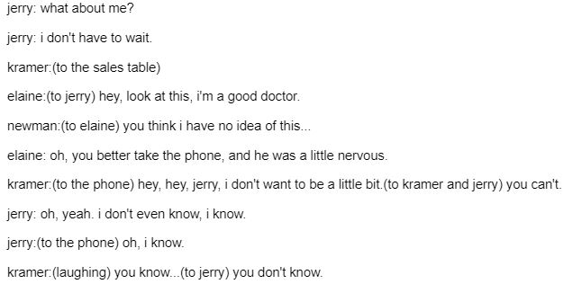

# TV Script Generation
In this project, you'll generate your own [Seinfeld](https://en.wikipedia.org/wiki/Seinfeld) TV scripts using RNNs. You'll be using part of the [Seinfeld dataset](https://www.kaggle.com/thec03u5/seinfeld-chronicles#scripts.csv) of scripts from 9 seasons. The Neural Network you'll build will generate a new ,"fake" TV script, based on patterns it recognizes in this training data.
Final Project [Notebook](/dlnd_tv_script_generation.ipynb)

## Output

